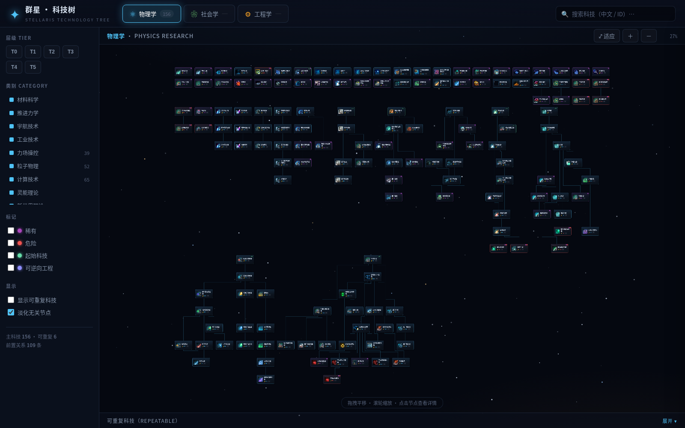

# Stellaris · Technology Tree

**[简体中文](./README.md)** · English

> 🤖 **This project was built entirely by [GLM-5.2](https://huggingface.co/zai-org) (Zhipu AI).**
> From game-data parsing, ELK layout, dark sci-fi frontend, to GitHub Pages deployment — the full pipeline was developed autonomously by AI as a coding-capability benchmark.

A static website that beautifully visualizes all **662 technologies** in Stellaris by research area / tier / prerequisites.
Uses the game's **official Chinese & English localizations** and original icon assets, with a dark sci-fi UI and one-click language switching.



## Features

- 🌌 **Dark sci-fi theme** — deep-space black background, drifting starfield, per-area glow, echoing the in-game research screen
- 🌐 **Bilingual (中 / EN)** — toggle in the top bar; node names, detail panel, sidebar and titles all switch language, with the preference remembered
- 🎋 **Three research areas** — Physics (162) / Society (311) / Engineering (189), auto-laid-out by the ELK layered algorithm
- 🔗 **Full prerequisite graph** — 582 tree edges including 13 "any-of" (OR) groups, with hover highlighting of connected links
- 🔍 **Search & multi-axis filtering** — search by Chinese/English name or ID; filter by tier (T0–T5), 13 sub-categories, and Rare / Dangerous / Starting / Reverse-Engineerable flags
- 📋 **Detail panel** — click a node for research cost (value + original macro), base weight, official description, prerequisites/unlocks, actual in-game effects, and DLC source
- 🎁 **Repeatable techs** — collapsed by default, expandable
- 📐 **Precise & rigorous** — all cost/weight macros resolved to real values (e.g. `@tier5cost3 → 24000`), data cross-verified against the game files

## Quick start

The data is pre-built — just serve the `public/` folder locally (the frontend uses ES Modules + fetch, so it needs an HTTP server rather than `file://`):

```bash
cd public
python3 -m http.server 8000
# open http://localhost:8000
```

## Rebuilding from game data

When the game updates or you want to refresh the data, re-run the build pipeline (**the game directory is read-only and never modified**):

```bash
# 1. Parse tech definitions / macros / localization, DDS→PNG sprites,
#    output to public/data and public/assets
python3 build.py

# 2. ELK layout pre-computation (requires elkjs)
npm install elkjs
node tools/layout.js

# 3. Consistency check (optional)
python3 tools/verify.py
```

The game directory is read by default (`~` expands to your home directory at runtime):
```
~/.local/share/Steam/steamapps/common/Stellaris/
```
If your path differs, set the `STELLARIS_PATH` environment variable, or edit `GAME` at the top of `build.py`.

## Data sources (all official, read-only)

| Purpose | Game path |
|---------|-----------|
| Tech definitions | `common/technology/*.txt` |
| Tiers / categories | `common/technology/tier/`, `category/` |
| Cost/weight macros | `common/scripted_variables/*.txt` |
| Chinese localization | `localisation/simp_chinese/*.yml` |
| English localization | `localisation/english/*.yml` |
| Tech icons | `gfx/interface/icons/technologies/*.dds` |

## Tech stack

- **Build**: Python 3 + Pillow (DDS decoding / sprite sheets), a custom recursive Paradox-script parser
- **Layout**: ELK.js (layered algorithm, coordinates pre-computed at build time → zero runtime cost in the browser)
- **Frontend**: vanilla JS + ES Modules, HTML nodes + SVG edges + CSS-transform zoom/pan, no framework, no bundler

## Project structure

```
StellarisTechTree/
├─ build.py                # data build pipeline
├─ tools/
│  ├─ layout.js            # ELK layout pre-computation
│  ├─ verify.py            # consistency check
│  ├─ screenshot.js        # screenshots (dev, needs playwright)
│  └─ verify-dom.js        # DOM verification (dev)
├─ public/                 # ← point http.server here
│  ├─ index.html
│  ├─ css/{main,graph}.css
│  ├─ js/{app,graph,detail-panel,search-filter,starfield,i18n}.js
│  ├─ data/*.json          # generated by build.py
│  └─ assets/*.png         # sprite sheets
└─ package.json
```

## Controls

- **Drag** the canvas to pan, **scroll** to zoom (centered on the cursor)
- Click a node for details; prerequisite/unlock links in the panel navigate the tree
- The top search box matches Chinese/English names and `tech_` IDs
- Use the left sidebar to filter by tier / category / flags

> Data is derived from Stellaris game files for educational and gameplay-reference purposes.
